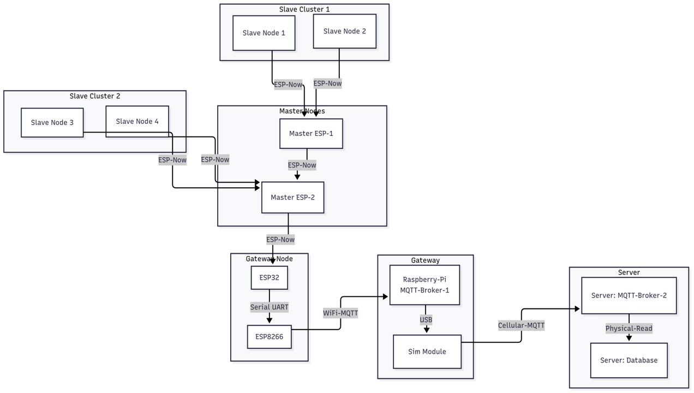

# VoidIQ
**VoidIQ** is a highly scalable and energy-efficient warehouse inventory monitoring system built using ESP32 microcontrollers in a **partial mesh ESP-NOW topology**. It uses ceiling-mounted ultrasonic sensors to estimate inventory levels  and transmits data across **multi-hop, clustered mesh networks** toward a cellular-enabled gateway using a **carry-and-forward** approach.

## System Architecture

_Figure: VoidIQ's hierarchical communication topology with slave clusters, master nodes, relay tiers, and a cellular-enabled gateway pushing data to the cloud._

---

## Features

- ESP-NOW Partial Mesh  
  Slave and master nodes form dynamic clusters that communicate without requiring Wi-Fi.

- Carry-and-Forward Multi-hop Routing  
  Master nodes relay data from slave nodes and other forwarding master nodes closer to the edge gateway reliably.

- Precision Inventory Monitoring  
  Ceiling-mounted ultrasonic sensors detect object presence and estimate stock volume per square meter.

- Low Power Operation (TO BE ADDED) 
  Nodes operate in deep sleep and wake up at scheduled intervals (e.g., 3 times per day).

- MQTT over WiFi
  Master nodes forward data to a relay ESP32 Node which serially sends data to a separate gateway node responsible for WiFi configuration and MQTT 

- MQTT over Cellular  (TO BE ADDED)
  Gateway nodes with SIM7600/SIM7670 transmit data to remote cloud brokers via GSM.

- Modular Architecture  
  Designed to scale from small warehouses to multi-site industrial operations with minimal reconfiguration.

---

## License

This project is licensed for non-commercial, academic, and personal use only.  
Commercial use is strictly prohibited without prior written permission.  
See the [`LICENSE`](LICENSE) file for full terms.

---

## Author

Developed by Divyanshu Nautiyal 
Contact: divyanshunautiyal2003@gmail.com
